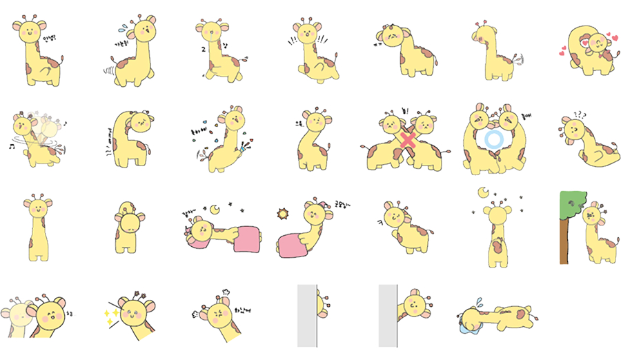
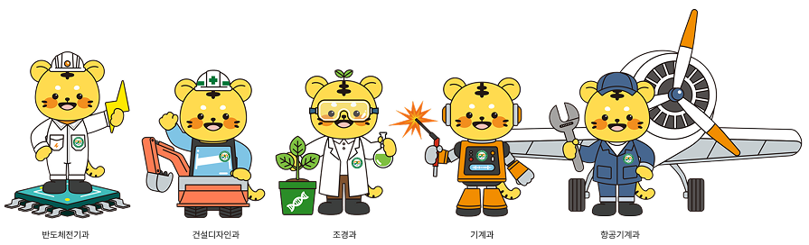

## HELLO! 👋
사용자에게 즐거움을 주는 제품과 서비스를 만드는 데 열정을 느껴왔습니다.
이제는 **사용자와 직접 상호작용하는 UX&UI** 제작에 집중하며, 팀원들과의 협업 프로젝트에 애정을 쏟고 있습니다.

프론트엔드 공부 기간은 짧지만, **Next.js, React-Query, 다양한 상태 관리 라이브러리** 등을 빠르게 습득하며 알찬 성장을 이루었다 자부합니다.
새로운 기술을 적극적으로 학습하여 **사용성, 성능, 미적 가치를 모두 갖춘** 더욱 멋진 프로젝트를 만들어가겠습니다.

---

## 🛠️ 기술 스택 (Tech Stack)

### 💻 Frontend Core & Styling

### 🔄 React Ecosystem & State Management

### 🚀 Frameworks & Runtime

### 💾 Database & Backend

### 🎨 Design & Tools

---

## 💻 프로젝트 목록 (Projects)

### 🤝 Teamwork Projects (협업 및 서비스 구축 경험)
1. **ROOKie** (React, Firebase, Zustand) 👨‍💻
2. **Metaphor** (HTML, CSS, FullPage.js) ✨
3. **NONGDAM** (HTML, CSS, 애니메이션) 🎨
4. **PETOPIA** (UI/UX 기획 및 디자인) 📐

### 🚀 Mywork Projects (개인 역량 집중 및 성능 최적화 경험)
1. **Onebite sky** (Next.js, ISR, 성능 최적화) 📈
2. **Coin Dashboard** (React, React-Query) 💰
3. **We design places** (웹 퍼블리싱) 🌐
4. **Netflix clone coding** (React 클론) 🎬
5. **Fullpage Customizing** (FullPage.js 커스텀) ⚙️
6. **Cyworld hamseter** (웹 퍼블리싱) 🐹

### 🎨 Designwork (캐릭터 기획 및 상용화 경험)
1. **목으로 말해요 기롱이** (이모티콘 & 굿즈 기획) 🦒
   
 

2. **학과별 캐릭터** (고객 소통 기반, 실제 굿즈 제작) 🐯
   
  

---

## 👉 완성된 포트폴리오 보러가기 
🌐 **https://hbflowportfoilo.netlify.app/**

---
